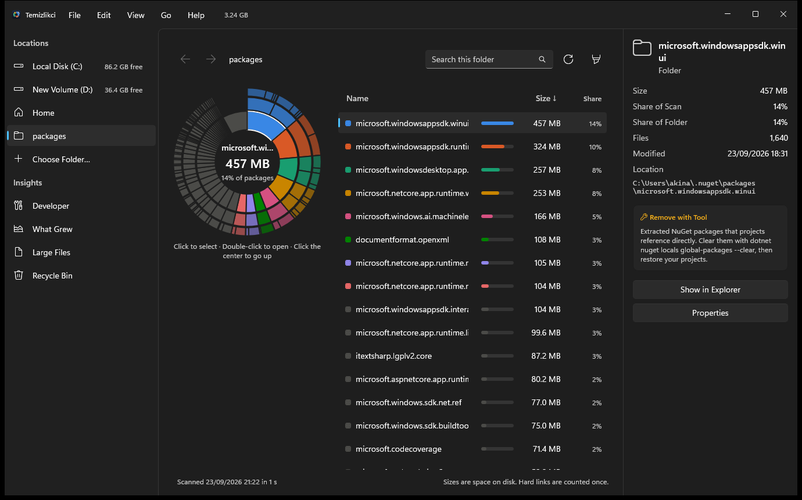
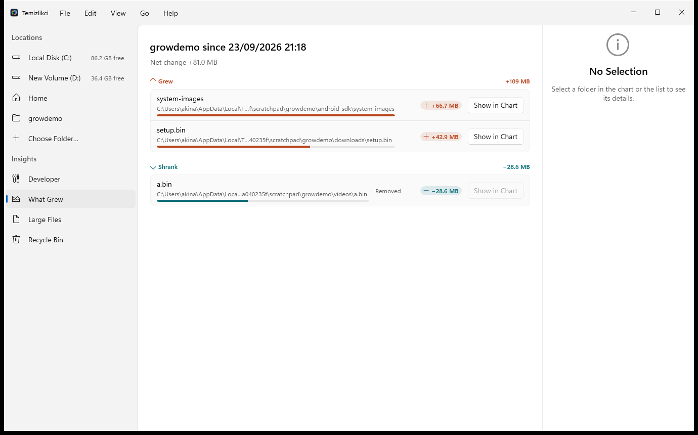
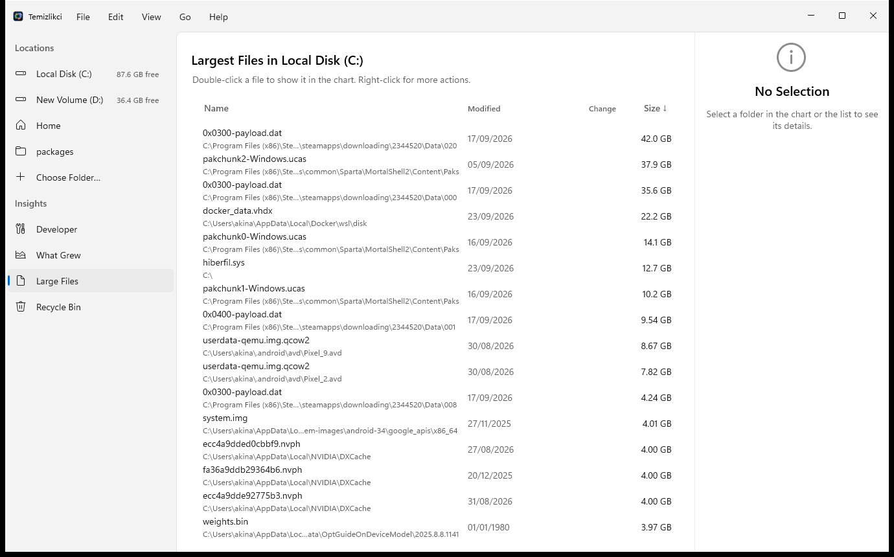
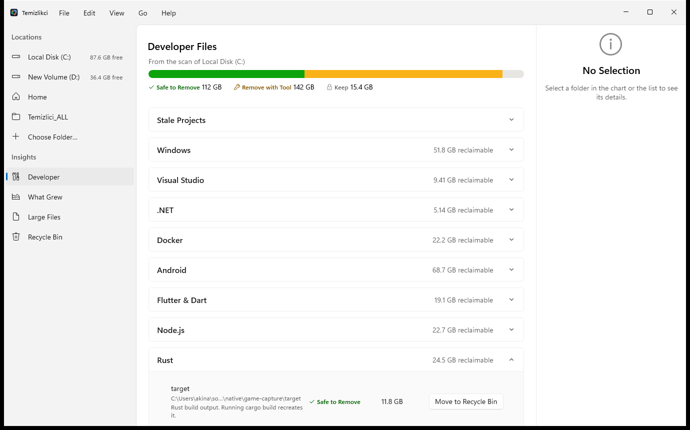

<h1 align="center">Temizlikci for Windows</h1>

<p align="center">
  <strong>See what's filling your PC. Clean up what's safe. Keep what isn't.</strong><br>
  A native Windows 11 disk analyzer that knows what developer files are and which ones you can delete —
  the Windows port of <a href="https://github.com/akinalpfdn/Temizlikci">Temizlikci for macOS</a>.
</p>

<p align="center">
  
  
  
  
</p>

<p align="center">
  
</p>

---

## Why

A developer's PC fills itself up: `bin` and `obj` folders, `node_modules`, Gradle and NuGet caches, Android
emulators, WSL disks that only ever grow, and Windows' own update leftovers.

General disk tools show you *that* a folder is big. They can't tell you whether it's build output the next build
recreates, a WSL disk you should compact with Windows' own tools, or the component store only DISM may touch. So you
either leave the space alone or delete things and hope.

Temizlikci shows where the space went and labels every developer file it recognizes. Files only ever go to the Recycle
Bin, where you can put them back; everything else is removed through the tool that owns it, after you confirm.

## What it does

### See where your space went
- **Sunburst chart and a synchronized list.** Click into any folder; the chart and the sortable, searchable list follow
  each other. Arrow keys, Enter and Escape work on the chart too, and screen readers can read its segments.
- **Other Used Space, explained.** On a whole drive, the space no folder accounts for is split into what it is: NTFS's
  own files, restore points and shadow copies, and whatever remains — never a made-up number.
- **What Grew.** Every scan leaves a small summary. The next scan tells you what grew and what shrank, and the list
  shows the change next to every folder.
- **Large Files.** The biggest individual files, one click from the chart or Explorer.

<p align="center">
  
  
</p>

### Clean up without guessing
- **63 rules** for Windows itself, Visual Studio, .NET, WSL, Docker, Android, Flutter, Node (npm, Yarn, pnpm, Bun),
  Rust, Go, Python, Java and Gradle, Unity and editors.
- **Three labels, each with a reason:**

  | Label | Meaning | Examples |
  |---|---|---|
  | **Safe to Remove** | The tool rebuilds it | `bin`/`obj`, `node_modules`, Gradle caches, Rust `target` |
  | **Remove with Tool** | Deleting it by hand breaks something; the app opens the right tool | WinSxS (DISM), WSL disks, update downloads (Storage Settings), NuGet packages (`dotnet nuget locals`) |
  | **Keep** | Needed by Windows or holding your data | the page file, Windows Installer cache, app data of Store apps |

- **Nothing is deleted.** Items go to the Recycle Bin, with Undo and Put Back. Anything labelled *Keep* or *Remove with
  Tool* — and anything inside it — can't be moved from Temizlikci at all, and Windows' own folders are never offered.
  There is no "clean everything" button, on purpose.
- **Windows' own tools, properly.** Compact a WSL disk (`diskpart`, read-only attach) or remove a distribution
  (`wsl --unregister`), clean up the component store with DISM, and open Storage Settings, System Protection or
  Android Studio's Device Manager — each after a confirmation that says what will happen. Docker Desktop's
  distributions are left to Docker.

<p align="center">
  
</p>

### Made for developers
- **Stale projects.** Projects nobody has touched for 30 days to a year, with the build output they still hold.
  "Last worked on" comes from Git, not from folder dates.
- **Unpushed work warnings.** Before you delete an old project, Temizlikci tells you what exists only on this PC:
  uncommitted and untracked files, stashes, a missing remote, and commits no remote has — on every branch. It reads Git
  without writing anything (`--no-optional-locks`, and a repository's own fsmonitor never runs).
- **Open in your editor.** Visual Studio (the solution), Android Studio, or Visual Studio Code, straight from the
  project.

### And it's quick about it
- **Opens instantly.** The last scan is saved and shown at launch, then refreshed in the background once it's older
  than you choose.
- **Grows while it scans.** Large folders fill the chart as they're read.
- **Reads the Master File Table when it can.** Run as administrator, a whole drive is measured from NTFS's own index
  instead of folder by folder; without administrator rights it walks the folders it may read and says how many it
  couldn't.
- **"What is this?"** Temizlikci identifies Windows' known folders, the app behind a folder in AppData or a Store
  package, and file types.

## Privacy

- No analytics, no accounts, no tracking.
- The only network request is a check for new versions on GitHub, at most once a day. It sends nothing about your PC
  or your files, and you can turn it off in Settings.
- Scans only read file names, sizes and dates. Nothing is changed or deleted while it scans.

## Install

1. Download `Temizlikci-<version>-win-x64.zip` from the [Releases](https://github.com/akinalpfdn/Temizlikci-Windows/releases)
   page and unzip it anywhere.
2. Run `Temizlikci.exe`. Nothing else needs to be installed: .NET and the Windows App SDK are included.
3. Optional: **File › Restart as Administrator** (or the setting to always start that way) lets Temizlikci measure
   every folder and read the Master File Table.

Temizlikci tells you when a new version is out. It never installs anything by itself; you download the new version and
replace the folder.

**Requirements:** Windows 11 (22H2 or later), x64.

## Build from source

Requires the .NET 10 SDK on Windows 11 (x64). No Visual Studio needed.

```powershell
git clone https://github.com/akinalpfdn/Temizlikci-Windows.git
cd Temizlikci-Windows
dotnet build Temizlikci.slnx -c Debug
dotnet test --project tests\Temizlikci.Tests
.\src\Temizlikci.App\bin\Debug\net10.0-windows10.0.26100.0\win-x64\Temizlikci.exe
```

`.\scripts\publish.ps1` runs the tests and builds the self-contained release zip in `artifacts\`.

The tests use temporary folders and in-memory stubs. They never touch your real files, your Recycle Bin, or your WSL
distributions.

## How it's built

WinUI 3 (Windows App SDK, unpackaged and self-contained) on .NET 10, with Win2D for the chart and no other
third-party UI code. The scanner reads directories with `NtQueryDirectoryFile` off the UI thread, or the Master File
Table directly when elevated. View models live in a library without WinUI types, so they are unit-tested; every
user-facing string lives in one resource file, and every color comes from the theme, with High Contrast mapped to
system colors.

| Path | Contents |
|---|---|
| `src/Temizlikci.Domain` | The scan tree, cleanup rules, history, chart layout — plain .NET with tests |
| `src/Temizlikci.Services` | Scanners, Recycle Bin, volumes, Git, WSL, DISM, editors, update check — Windows implementations |
| `src/Temizlikci.Presentation` | View models, strings, formatting, chart palette |
| `src/Temizlikci.App` | WinUI views, theme resources, the Win2D chart |
| `tests/Temizlikci.Tests` | xUnit v3 suites |

Why things are the way they are is written down in [DECISIONS.md](DECISIONS.md).

## License

[MIT](LICENSE) © Akinalp Fidan
